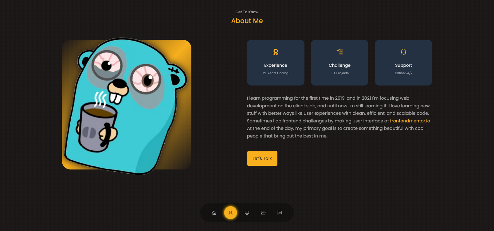

# nextjs-portfolio
> Code along with **Ernest Achiever** from [📺 youtube](https://www.youtube.com/watch?v=G-Cr00UYokU "Ernest Achiever's youtube")  

## About the Project
Re-learn basic of frontend web development after not actively code for the last few months. The project is about creating portfolio web layout using **Next JS**.

**Preview** 👓
<p align="center">
  
</p>

 **Demo**: https://nextjs-portfolio-xvferdy.vercel.app

## Installation
```
npm install
```
```
npm run dev
```

### 📦 Highlighted package
- [emailjs-com](https://www.emailjs.com/ "emailjs")
- [react-icons](https://react-icons.github.io/react-icons/ "react-icons")
- [swiper](https://swiperjs.com/ "swiper")

## What I learned

<details>
    <summary>☑️ <b>max-content</b></summary> <br>
  
`width: max-content` & `height: fit-content` sizing html element base on content's height & height.
###### styles/scss/components\_portfolio.scss
```scss
h3 {
      margin: 1.2rem 0 2rem;
      position: relative;
      width: fit-content;
      z-index: 3;
      &::before {
        content: "";
        opacity: 0;
        bottom: 0;
        // width: 175px;
        width: 100%;
        height: 14px;
        transform: skew(-10deg, -3deg);
        background: darken($primary-variant-color, 10%);
        z-index: -1;
        position: absolute;
        transition: 0.3s ease-in-out;
      }
```  
</details>


<details>
    <summary>☑️ <b>Transparent gradient</b></summary> <br>
  
`background: linear-gradient($primary-color, transparent)`
###### styles/scss/components\_header.scss
```scss
.me {
      background: linear-gradient($primary-color, transparent);
      width: 22rem;
      height: 30rem;
      position: absolute;
      left: calc(50% - 22rem / 2);
      margin-top: 4rem;
      border-radius: 12rem 12rem 0 0;
      overflow: hidden;
      padding: 5rem 1.5rem 1.5rem 1.5rem;
    }
```  
</details>

<details>
    <summary>☑️ <b>Unselectable element</b></summary> <br>
  
`user-select: none` good for things like carousel 
###### styles/scss/components\_quotes.scss
```scss
.quote {
    background-color: $background-variant-color;
    min-height: 320px;
    text-align: center;
    padding: 2rem;
    border-radius: 2rem;
    user-select: none;
  }
```  
</details>

<details>
    <summary>☑️ <b>word-break</b></summary> <br>
  
`word-break: break-all` to wrap long element (that has no space)
###### styles/scss/components\_contact.scss
```scss
&__option {
    background-color: $background-variant-color;
    padding: 1.2rem;
    border-radius: 1.2rem;
    text-align: center;
    border: 1px solid transparent;
    transition: $transition;
    cursor: default;
    word-break: break-all;
  }
```  
</details>


<details>
    <summary>☑️ <b>Auto reset on form submit</b></summary> <br>
  
`e.target.reset()` often used with `useRef()`
###### components/Contact.jsx
```js
  const sendEmail = (e) => {
    e.preventDefault();
    console.log(form);
    emailjs.sendForm(serviceId, templateId, form.current, userId)
    e.target.reset();
  };
```
</details>

<details>
    <summary>☑️ <b>Respect deadlines</b></summary> <br>
  
Should have left some extra time for testing the production sites and write some documentation

</details>

<h3 align="right">
      <a href="#readme">To Top ⤴️</a>
</h3>
